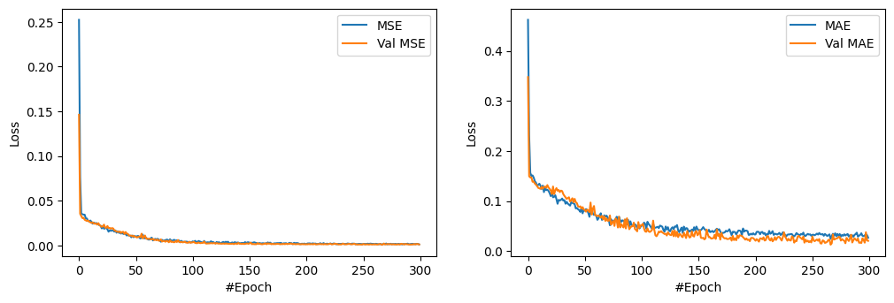
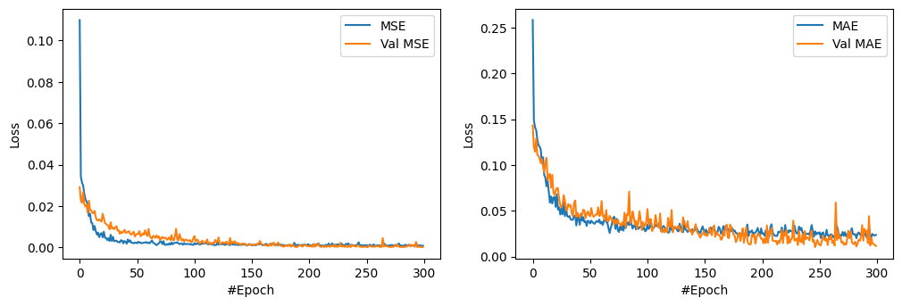

#

    

<h1 align="center">
  EMG Controlled Adaptive Wearable Robotic Exoskeleton for Upper Limb Rehabilitation Using AI
</h1>

# 

 
The methodology applied in this research is targeted at making use of state-of-the-art Deep 
Learning and Machine Learning techniques to enable accurate prediction of the Range of 
Motion angle. Concretely, Gated Recurrent Units (GRUs) and Long Short-Term Memory 
(LSTM) networks have been implemented as the core deep learning models. These 
architectures are chosen for their proven ability to capture temporal dependencies and handle 
sequential data effectively, making them particularly suitable for time-series prediction tasks 
like ROM angle estimation. Besides deep learning approaches, several machine learning 
algorithms have been utilized to complement the predictive analysis. It includes models such as K-Nearest Neighbors Regressor, Support Vector Regression, and 
Random Forest Regressor. Each model offers specific benefits: KNN offers better capabilities 
in the explanation of local patterns of data; SVR makes robust predictions owing to its ability 
to deal with non-linear relationships, and Random Forest comes with strong performance via 
ensemble learning to prevent overfitting. 

#    
# Analysis of the Results 

 
Since the goal of this study is to predict a continuous 
variable, the ROM angle, and regression-based artificial intelligence models are applied. Both deep 
learning and traditional machine learning algorithms are combined in this study to ensure 
comprehensiveness in the approach to the prediction by combining the strengths of sequential 
modelling with feature-focused regressors for overall improved accuracy and reliability. We 
have graded these algorithms according to the  R2 Score, MSE and MAE results of the machine 
learning algorithms. 

    

## 1. Support Vector Regression (SVR):

 
The results summarize the performance of the Support Vector Regression model in the 
prediction of the target variable, using metrics such as R², MSE, MAE, and RMSE. These 
metrics have been evaluated using a 10-fold cross-validation approach, where the dataset was 
split into ten subsets, and the model was trained and tested on different combinations of these 
subsets. Here's a detailed breakdown: 

    
| Cross-Validation Split | R2 Score  | MSE       | MAE       | RMSE     |
|:-----------------------:|-----------|-----------|-----------|----------|
| 1                       | 0.656371  | 66.381072 | 6.840942  | 8.147458 |
| 2                       | 0.313708  | 32.001188 | 5.052802  | 5.656959 |
| 3                       | 0.685755  | 14.807428 | 3.424892  | 3.848042 |
| 4                       | 0.942447  | 7.558939  | 1.945472  | 2.749352 |
| 5                       | 0.899167  | 11.497509 | 2.797446  | 3.390798 |
| 6                       | 0.913922  | 9.490316  | 2.573259  | 3.080636 |
| 7                       | 0.905561  | 7.999321  | 2.096159  | 2.828307 |
| 8                       | 0.903377  | 8.672771  | 2.515685  | 2.944957 |
| 9                       | 0.914370  | 13.314672 | 3.272796  | 3.648928 |
| 10                      | 0.902287  | 13.368730 | 3.374741  | 3.656327 |
| **Averages**            | 0.803696  | 18.509195 | 3.389419  | 3.995176 |

The cross-validation table summarizes the performance of the Support Vector Regression 
model in ten different data splits. It provides, for each fold, key metrics such as R² (coefficient 
of determination), MSE (Mean Squared Error), MAE (Mean Absolute Error), and RMSE (Root 
Mean Squared Error), showing the accuracy and reliability of the model. The average R² value 
of the SVR model is 0.8037, which means that, on average, it explains about 80% of the 
variance in the target variable, with an average MSE of 18.51 and an MAE of 3.39. However, 
the results over folds are very different, with some R² scores as low as 0.31 and as high as 0.94, 
while the MSE values range from 7.56 to 66.38. It follows that the variability in the 
performance also suggests sensitivity to the distribution of the data in each fold. Thus, while 
the model in general performs well, further optimisation could help bring these performances 
closer together. Indeed, the best performance happens to be in fold 4, which is outstanding by 
its lowest error metrics value; hence, it can present a benchmark for improvement.

**Overall Metrics:**

•	**Average R²: 0.803696**

This shows that the average SVR model explains around 80.37% of the variance in the 
target variable and is a strong overall fit.

•	**Average MSE: 18.509195**

The average MSE simply provides a measure of the average of the squared differences 
between predicted and actual values. This shows the magnitude of the overall error, where 
lower values are better. While an MSE of 18.51 is acceptable, some scope for further 
improvement remains.

•	**Average MAE: 3.389419**

This means that, on average, the difference between the predicted and actual values is 
around 3.39 units. It is a simple measure of accuracy in prediction.

•	**Average RMSE: 3.995176**

The RMSE is the standard deviation of the prediction errors and gives a better interpretation 
of the reliability of the prediction. An RMSE of 3.99 means the predictions are usually 
about 4 units off from the actual values.

## 2. Random Forest Regressor (RFR):

The table shows the cross-validation performance of the RFR model for ten different data splits. 
The main evaluation metrics include R², representing the coefficient of determination; MSE, 
which is the Mean Squared Error; MAE, the Mean Absolute Error; and RMSE, the Root Mean 
Squared Error, all of which give a full view of the model's predictability.

    
| Cross-Validation Split | R2 Score  | MSE       | MAE       | RMSE     |
|:-----------------------:|-----------|-----------|-----------|----------|
| 1                       | 0.823812  | 34.035417 | 4.658643  | 5.833988 |
| 2                       | 0.697794  | 14.091627 | 2.840062  | 3.753882 |
| 3                       | 0.971930  | 1.742091  | 0.913886  | 1.319883 |
| 4                       | 0.943781  | 4.190285  | 1.382041  | 2.047018 |
| 5                       | 0.948241  | 3.883101  | 1.321665  | 1.970558 |
| 6                       | 0.893160  | 4.867509  | 1.611156  | 2.206243 |
| 7                       | 0.991379  | 1.426605  | 0.818089  | 1.194406 |
| 8                       | 0.767034  | 16.429321 | 3.215079  | 4.053310 |
| 9                       | 0.986421  | 1.053367  | 0.700370  | 1.026337 |
| 10                      | 0.987504  | 2.166532  | 1.014344  | 1.471915 |
| **Average**             | 0.901105  | 8.388585  | 1.847534  | 2.487754 |

It turns out that the RFR model has a very strong overall performance, with an R² score of 
0.9011, thereby explaining more than 90% of the variance in the target variable. The average 
error metrics with an MSE at 8.39, MAE at 1.85, and RMSE at 2.49 provide further underlining 
of its accuracy and reliability. It is also seen that performances across individual folds are 
remarkably consistent, with R² values varying between 0.698 to 0.991, and showing a robust 
ability to generalize across data splits. 
The best performance is observed in folds 7 and 9, where the R² scores are above 0.986 and 
the error metrics are the lowest, particularly an MSE as low as 1.05 in fold 9. This suggests the 
model's exceptional accuracy in these cases. In contrast, fold 1 has a relatively higher MSE of 
34.03 and MAE of 4.66, indicating that the model generally performs well but may be sensitive 
to the distribution of data in certain splits.

**Overall Metrics:**

•	**Average R²: 0.901105**

This suggests that the model RFR explains about 90.11% of the variance in the target variable, 
hence a very strong fit and reliable predictive capability. 

•	**Average MSE: 8.388585**

The Mean Squared Error of 8.39 is representative of the average squared differences between 
predicted and actual values. This relatively low value suggests that the model retains most of 
the accuracy, hence not large deviations.

•	**Average MAE: 1.847534**

The Mean Absolute Error means that, on average, predictions are off by just 1.85 units. This 
low MAE showcases the model's capability for delivering highly accurate predictions.

•	**Average RMSE: 2.487754**

The Root Mean Squared Error of 2.49 measures the standard deviation of prediction errors, 
indicating that normally, the predictions will vary by about 2.49 units from the true values. 
This supports that the model has performed soundly and is reliable.

## 3. K-Nearest Neighbours (KNN):

 
The table depicts the cross-validation performance of the KNN model against ten data splits. 
The evaluation metrics that have been used in the current analysis are the R², which is the 
coefficient of determination; MSE, the Mean Squared Error; MAE, the Mean Absolute Error; and 
RMSE, Root Mean Squared Error, showing a comprehensive view of the model's predictive 
capabilities. The table depicts the cross-validation performance of the K-Nearest Neighbours 
model against ten data splits.

    
| Cross-Validation Split | R2 Score  | MSE       | MAE       | RMSE     |
|:-----------------------:|-----------|-----------|-----------|----------|
| 1                       | 0.693911  | 59.129093 | 4.430968  | 7.689544 |
| 2                       | 0.923459  | 3.569030  | 1.501328  | 1.889188 |
| 3                       | 0.979217  | 0.979315  | 0.801429  | 0.989604 |
| 4                       | 0.980338  | 2.582316  | 1.138268  | 1.606959 |
| 5                       | 0.994687  | 0.605803  | 0.558870  | 0.778334 |
| 6                       | 0.969648  | 3.346397  | 1.352539  | 1.829316 |
| 7                       | 0.987076  | 1.094700  | 0.728928  | 1.046279 |
| 8                       | 0.988542  | 1.028425  | 0.743954  | 1.014113 |
| 9                       | 0.987118  | 2.003031  | 1.216768  | 1.415285 |
| 10                      | 0.976144  | 3.263933  | 1.344803  | 1.806636 |
| **Averages**            | 0.948014  | 7.760204  | 1.381786  | 2.006526 |

 
The table displays the performance of the K-Nearest Neighbours (KNN) algorithm evaluated 
through cross-validation across 10 splits. The performance, in terms of the R² score, ranges 
between 0.6939 and 0.9947 with an average of 0.9480, which means that on average, the KNN 
model explains about 94.8% of the variance within the target variable, implying strong 
predictive power. The MSE values vary between a minimum of 0.6058 to a maximum of 
59.1291, with an average of 7.7602. Although in most of the splits, the MSE is very low, the 
first split has a large error; that may indicate how well the model generalizes concerning 
variations in training data. The MAE ranges from 0.5589 to 4.4309, with an average of 1.3818, 
which means that on average, the model's predictions deviate by about 1.38 units from the 
actual values. The RMSE ranges from 0.7783 to 7.6895, with an average of 2.0065, which 
means that on average, the KNN model's predictions deviate by about 2 units. Overall, the 
KNN algorithm shows quite good predictive performance with an average R² indicating 
reasonable model fit, though there is some fluctuation within the error metrics of splits. 

**Overall Metrics:**

•	**Average R²: 0.948014**

The average R² value of 0.948 indicates that about 94.8% of the variance in the target variable 
is explained by the KNN model. This is an excellent fit; the model captures most of the 
underlying patterns in the data.

•	**Average MSE: 7.760204**

he MSE value of 7.76 implies that, on average, the difference between the forecasted and 
actual values are relatively small in a squared sense. Although this value is acceptable, it leaves 
much room for further improvement to reduce especially larger error values.

•	**Average MAE: 1.381786**

A Mean Absolute Error of 1.38 illustrates that the KNN model is generally off by 
approximately 1.38 units. It is a good way of getting at the accuracy of this predictor since it 
gives a great general interpretation - these values in forecasts for this model are close.

•	**Average RMSE: 2.006526**

A root mean squared error of 2.01 would translate to the fact that this is the typical deviation 
by a unit or two away from actual values, hence very strong and usually reliable in this way, 
with a pretty reasonable degree of error. 
The LSTM and GRU are deep learning models selected to do the best performance in the 
time sequence prediction.

## 4. Gated Recurrent Units (GRU):

The data was divided into 90% training and 10% test datasets. Based on this, out of the 
available data, 114 samples were used for training, and the remaining 13 were used for testing 
and validation. 

This split ensures that the model is trained on a substantial portion of the data while still being 
evaluated on an independent set to gauge its generalization performance. 
This results in an excellent R² of 0.9796, where 97.96% of the variation in the target variable 
has been correctly explained by this model. On top of this, its MAE reached 1.10, which 
suggests that, on average, the difference between the real and the estimated value is no more 
than 1.10 units. The Mean Squared Error of 1.94 shows the minimal magnitude of the squared 
differences, while the RMSE of 1.39 points to the strong predictive accuracy of the model 
since lower RMSE values indicate better performance. These metrics demonstrate the model's 
robust learning ability and its potential to make highly reliable predictions, even when tested 
on unseen data. The low error values and high R² score are indicative of a well-tuned and 
effective model, suitable for tackling real-world regression tasks.

    
|Matrix |Score|
|:-----:|:-------:|
|R2 score| 0.97961025|
|MAE | 1.104778|
|MSE | 1.937539|
|RMSE | 1.391955|

**Explanation of the MSE and MAE Graphs:**

    

**MSE Graph (Left Panel):**

The MSE graph shows the loss of both training and validation 
across 300 epochs. The training and validation loss starts off high but then rapidly decreases 
as the model learns from the data. By around 50 epochs, the MSE values stabilize at very low 
levels, indicating effective learning and minimal overfitting. The closeness of the training and 
validation MSE curves means that the model generalizes well to unseen data.

**MAE Graph (Right Panel):** 

Similarly, the MAE graph shows the reduction of error in training 
and validation. Both curves show a sharp decline in error during the initial epochs, eventually 
stabilizing at values close to zero. The smooth convergence of the training and validation MAE 
curves further confirms the model's robustness and its ability to handle temporal dependencies 
in the dataset effectively. 
These graphs highlight the GRU model’s strong learning capacity and the consistency between 
training and validation performance, reflecting the model’s reliability in making accurate 
predictions. 

## 5. Long Short-Term Memory (LSTM):

The dataset was divided into a 90%-10% split, with 114 samples used for training and 13 samples for testing and validation.

The LSTM algorithm performed extremely well, with an R² score of 0.9892, which indicates 
that 98.92% of the variance in the target variable was explained by the model. The MAE was 
0.5823, and the MSE was 0.7019, reflecting the high accuracy of the model. The RMSE was 
0.8378, which again speaks to the LSTM model's ability to make precise and reliable 
predictions. 

                          
|Matrix |Score|
|:-----:|:-------:|
|R2 score| 0.989230|
|MAE     | 0.582275|
|MSE     | 0.701869|
|RMSE    | 0.837776|

**Explanation of the MSE and MAE Training Graphs:**

    

**MSE Graph (Left Panel):**

The MSE graph illustrates how the model's loss evolved over 300 
epochs on both training and validation datasets. At the start, the MSE values are very high 
because the weights have been initialized randomly; these start to decrease rapidly as the model 
starts learning patterns in the data. By about 50 epochs, the loss for both training and validation 
stabilizes at very low values. The validation curve lies well with the training curve, indicating 
no severe overfitting, which demonstrates excellent generalization performance for unseen 
data. 

**MAE Graph (Right Panel):** 

The MAE graph also shows the decrease in error for training and 
validation. Similar to the MSE graph, the MAE values start high and decrease significantly 
during the initial epochs. Both training and validation MAE values converge smoothly, 
stabilizing at low levels by the 50th epoch. This reflects the model's capability of making highly 
accurate predictions with minimal error. 
    

The graphs really act as evidence for excellent learning capability by the LSTM model. The 
convergence of training and validation losses without much divergence is proof of the 
robustness of the model, while low final values of MSE and MAE show its high prediction 
accuracy.

## Final Results Analysis 
The performance of the different AI algorithms is evaluated based on their R², MAE, MSE, and RMSE scores. 

    
| AI Algorithm | R2 score  | MAE       | MSE       | RMSE     |
|:------------:|-----------|-----------|-----------|----------|
| SVR          | 0.803696  | 18.509195 | 3.389419  | 3.995176 |
| RFR          | 0.901105  | 8.388585  | 1.847534  | 2.487754 |
| KNN          | 0.948014  | 7.760204  | 1.381786  | 2.006526 |
| GRU          | 0.979610  | 1.104778  | 1.937539  | 1.391955 |
| LSTM         | 0.989230  | 0.582275  | 0.701869  | 0.837776 |

  
The SVR comes with an R² score of 0.803696, explaining about 80.37% of the variance in the 
target variable, with a mean MAE of 3.39 units and a mean MSE of 18.51. While the model 
performance is pretty good, its predictions could be further improved. While the performance 
of the SVR model is fair, the RFR does better with an R² score of 0.901105, showing that it 
explains 90.11% of the variance in data. It also achieves a lower MAE of 1.85 and a much
reduced MSE of 8.39, reflecting better prediction accuracy. The K-Nearest Neighbors model 
further enhances the performance of the models with a very good R² of 0.948014, depicting 
94.8% of the variance explained, and MAE and MSE of 1.38 and 7.76, respectively, showing 
an excellent predictive ability of the model. The performance of both GRU and LSTM is the 
best of all models, where the LSTM shows the highest value of R² as 0.989230, which explains 
98.92% of the variance. The MAE of 0.58, MSE of 0.70, and RMSE of 0.84 indicate 
a highly accurate prediction with relatively small errors. Overall, LSTM gave the best 
performance, closely followed by GRU, then KNN, RFR, and lastly SVR. 

#
