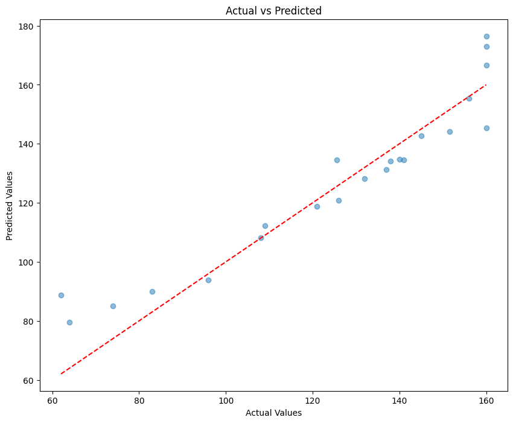
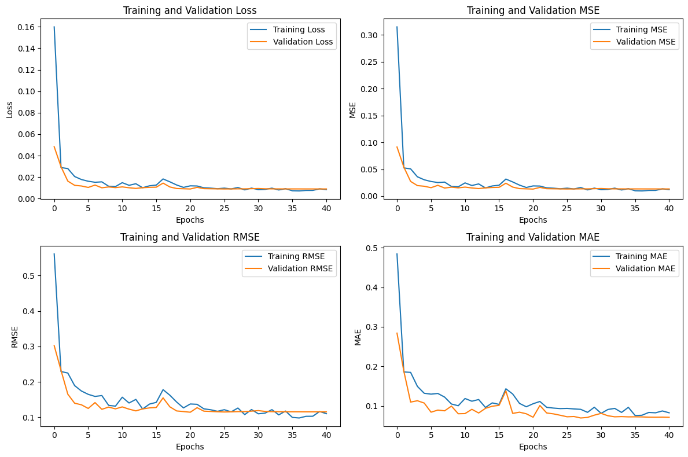
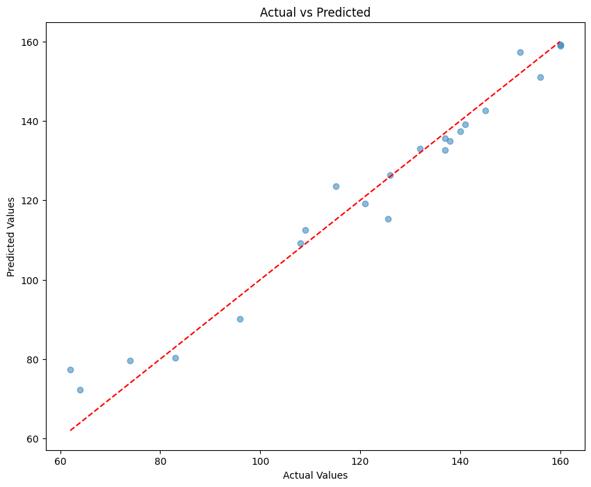
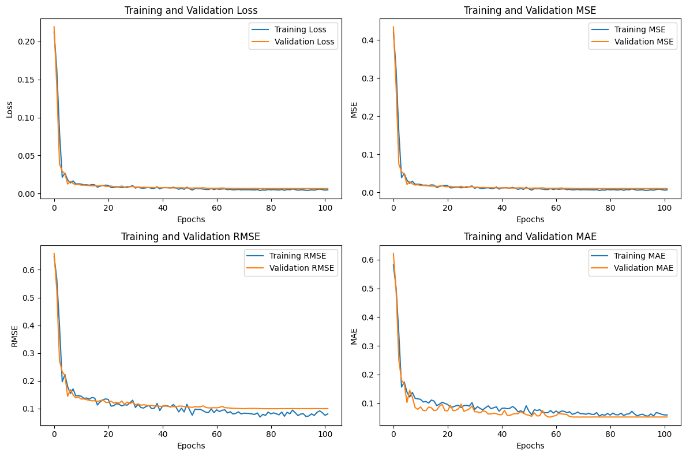

#

    

<h1 align="center">
  EMG Controlled Adaptive Wearable Robotic Exoskeleton for Upper Limb Rehabilitation Using AI
</h1>

# Introduction: 

 
The methodology applied in this research is targeted at making use of state-of-the-art Deep 
Learning and Machine Learning techniques to enable accurate prediction of the Range of 
Motion angle. Concretely, combination of Convolution Neural Network (CNN) and Long 
Short-Term Memory (LSTM) networks have been implemented as the core deep learning 
models. These architectures are chosen for their proven ability to capture temporal 
dependencies and handle sequential data effectively, making them particularly suitable for 
time-series prediction tasks like ROM angle estimation. Besides deep learning approaches, 
several machine learning algorithms have been utilized in complementing the predictive 
analysis. 

 
It includes models such as K-Nearest Neighbors Regressor, Support Vector Regression, and 
Random Forest Regressor. Each model offers specific benefits: KNN offers better capabilities 
in the explanation of local patterns of data; SVR makes robust predictions owing to its ability 
to deal with non-linear relationships, and Random Forest comes with strong performance via 
ensemble learning to prevent overfitting. Since the goal of this study is to predict a continuous 
variable, the ROM angle, regression-based artificial intelligence models are applied. Both deep 
learning and traditional machine learning algorithms are combined in this study to ensure 
comprehensiveness in the approach to prediction by combining strengths of sequential 
modeling with feature-focused regressors for overall improved accuracy and reliability. We 
have graded these algorithms according to the  R2 Score, MSE and MAE results of the machine 
learning algorithms. 

# Machine Learning Algorithms:

## 1. Support Vector Regression (SVR): 

 
The results summarize the performance of the Support Vector Regression model in the 
prediction of the target variable, using metrics such as R², MSE, MAE, and RMSE. These 
metrics have been evaluated using a 10-fold cross-validation approach, where the dataset was 
split into ten subsets, and the model was trained and tested on different combinations of these 
subsets. Here's a detailed breakdown: 

### Cross-Validation Model Performance Metrics

| Split | R² Score   | MSE        | MAE       | RMSE      |
|-------|------------|------------|-----------|-----------|
| 1     | 0.880788   | 116.716901 | 8.468126  | 10.803560 |
| 2     | 0.962370   | 34.204330  | 4.332857  | 5.848447  |
| 3     | 0.966066   | 20.311398  | 3.395496  | 4.506817  |
| 4     | 0.987101   | 11.346626  | 2.736462  | 3.368475  |
| 5     | 0.967420   | 39.325656  | 5.028527  | 6.271017  |
| 6     | 0.965511   | 38.650737  | 5.236807  | 6.216972  |
| 7     | 0.934138   | 31.552274  | 4.246053  | 5.617141  |
| 8     | 0.762263   | 103.189849 | 7.727724  | 10.158240 |
| 9     | 0.397892   | 365.678900 | 15.654461 | 19.122733 |
| 10    | 0.900760   | 82.326044  | 7.707689  | 9.073370  |
| **Averages** | **0.872431** | **84.330272** | **6.453420** | **8.098677** |

 
 
The cross-validation table summarizes the performance of the Support Vector Regression 
model in ten different data splits. It provides, for each fold, key metrics such as R² (coefficient 
of determination), MSE (Mean Squared Error), MAE (Mean Absolute Error), and RMSE (Root 
Mean Squared Error), showing the accuracy and reliability of the model. The average R² value 
of the SVR model is 0.8724, which means that, on average, it explains about 87% of the 
variance in the target variable, with an average MSE of 84.33 and an MAE of 6.45. However, 
the results over folds are very different, with some R² scores as low as 0.3979 and as high as 
0.9871, while the MSE values range from 11.34 to 365.68. It follows that the variability in the 
performance also suggests sensitivity to the distribution of the data in each fold. Thus, while 
the model in general performs well, further optimisation could help bring these performances 
closer together. Indeed, the best performance happens to be in fold 4, which is outstanding by 
its lowest error metrics value; hence, it can present a benchmark for improvement. 

### Overall Metrics: 
- Average R²: 0.8724 
This shows that the average SVR model explains around 87.24% of the variance in the 
target variable and is a strong overall fit. 
- Average MSE: 84.33 
The average MSE simply provides a measure of the average of the squared differences 
between predicted and actual values. This shows the magnitude of the overall error, where 
lower values are better. While an MSE of 84.33 is acceptable, some scope for further 
improvement remains. 
- Average MAE: 6.45 
This means that, on average, the difference between the predicted and actual values is 
around 6.45 units. It is a simple measure of accuracy in prediction. 
- Average RMSE: 8.09 
The RMSE is the standard deviation of the prediction errors and gives a better interpretation 
of the reliability of the prediction. An RMSE of 8.09 means the predictions are usually 
about 4 units off from the actual values. 
 
## 2. Random Forest Regressor (RFR): 
The table shows the cross-validation performance of the RFR model for ten different data splits. 
The main evaluation metrics include R², representing the coefficient of determination; MSE, 
which is the Mean Squared Error; MAE, the Mean Absolute Error; and RMSE, the Root Mean 
Squared Error, all of which give a full view of the model's predictability 
 

### Cross-Validation Model Performance Metrics

| Split | R² Score   | MSE        | MAE       | RMSE      |
|-------|------------|------------|-----------|-----------|
| 1     | 0.974277   | 25.184392  | 3.811050  | 5.018405  |
| 2     | 0.981725   | 16.611689  | 3.279112  | 4.075744  |
| 3     | 0.937172   | 37.605879  | 3.885652  | 6.132363  |
| 4     | 0.990682   | 8.196572   | 2.307594  | 2.862966  |
| 5     | 0.991054   | 10.798191  | 2.516204  | 3.286060  |
| 6     | 0.983860   | 18.087034  | 3.206893  | 4.252885  |
| 7     | 0.836449   | 78.351682  | 3.904582  | 8.851649  |
| 8     | 0.905894   | 40.846872  | 4.476150  | 6.391156  |
| 9     | 0.259270   | 449.868830 | 16.237434 | 21.210112 |
| 10    | 0.938153   | 51.305940  | 5.873304  | 7.162816  |
| **Average** | **0.879854** | **73.685708** | **4.949798** | **6.924416** |

It turns out that the RFR model has a very strong overall performance, with an R² score of 
0.8799, thereby explaining more than 87.99% of the variance in the target variable. The average 
error metrics with an MSE at 73.69, MAE at 4.95, and RMSE at 6.92 provide further 
underlining of its accuracy and reliability. It is also seen that performances across individual 
folds are remarkably consistent, with R² values varying between 0.2592 to 0.9911, and showing 
a robust ability to generalize across data splits. 
The best performance is observed in folds 4 and 5, where the R² scores are above 0.990 and 
the error metrics are the lowest, particularly an MSE as low as 8.197 in fold 4. This suggests 
the model's exceptional accuracy in these cases. In contrast, fold 9 has a relatively higher MSE 
of 449.87 and MAE of 16.24, indicating that the model generally performs well but may be 
sensitive to the distribution of data in certain splits. 

### Overall Metrics: 
- Average R²: 0.8799 
This suggests that the model RFR explains about 87.99% of the variance in the target variable, 
hence a very strong fit and reliable predictive capability.  
- Average MSE: 73.69 
The Mean Squared Error of 73.69 is representative of the average squared differences between 
predicted and actual values. This relatively low value suggests that the model retains most of 
the accuracy, hence not large deviations. 
- Average MAE: 4.95 
The Mean Absolute Error means that, on average, predictions are off by just 4.95  units. This 
low MAE showcases the model's capability for delivering highly accurate predictions. 
- Average RMSE: 6.92 
The Root Mean Squared Error of 6.92 measures the standard deviation of prediction errors, 
indicating that normally, the predictions will vary by about 6.29 units from the true values. 
This supports that the model has performed sound and is reliable. 

## 3. K-Nearest Neighbours (KNN): 
The table depicts the cross-validation performance of the KNN model against ten data splits.The evaluation metrics that have been used in the current analysis are the R², which is the coefficient of determination; MSE, the Mean Squared Error; MAE, Mean Absolute Error; and RMSE, Root Mean Squared Error, showing a comprehensive view of the model's predictive capabilities. The table depicts the cross-validation performance of the K-Nearest Neighbours model against ten data splits.  
 
### Cross-Validation Model Performance Metrics

| Split | R² Score   | MSE        | MAE       | RMSE      |
|-------|------------|------------|-----------|-----------|
| 1     | 0.978656   | 20.896855  | 3.637743  | 4.571308  |
| 2     | 0.977683   | 20.285714  | 3.285714  | 4.503967  |
| 3     | 0.939358   | 36.297493  | 4.781435  | 6.024740  |
| 4     | 0.968038   | 28.115759  | 3.855887  | 5.302430  |
| 5     | 0.981150   | 22.753631  | 3.750531  | 4.770077  |
| 6     | 0.979798   | 22.640057  | 3.217935  | 4.758157  |
| 7     | 0.837158   | 78.012114  | 5.544937  | 8.832447  |
| 8     | 0.599047   | 174.033657 | 8.153914  | 13.192182 |
| 9     | 0.115080   | 537.439791 | 18.044135 | 23.182748 |
| 10    | 0.958724   | 34.241423  | 4.648425  | 5.851617  |
| **Averages** | **0.833469** | **97.471649** | **5.892066** | **8.098967** |

The table displays the performance of the K-Nearest Neighbours (KNN) algorithm evaluated 
through cross-validation across 10 splits. The performance, in terms of the R² score, ranges 
between 0.9787 and 0.1151 with an average of 0.8334, which means that on average, the KNN 
model explains about 83.3% of the variance within the target variable, implying strong 
predictive power. The MSE values vary between a minimum of 20.29 to a maximum of 
174.03, with an average of 97.47 Although in most of the splits the MSE is very low, the first 
split has a large error; that may indicate how well the model generalizes with respect to 
variations in training data. The MAE ranges from 3.22 to 18.04, with an average of 5.89, which 
means that on average, the model's predictions deviate by about 1.38 units from the actual 
values. The RMSE ranges from 4.50 to 23.18, with an average of 8.10, which means that on 
average, the KNN model's predictions deviate by about 5 units. Overall, the KNN algorithm 
shows quite good predictive performance with an average R² indicating reasonable model fit, 
though there is some fluctuation within the error metrics of splits. 
 
- Average R²: 0.833469 
The average R² value of 0.833 indicates that about 83.3% of the variance in the target variable 
is explained by the KNN model. This is an excellent fit; the model captures most of the 
underlying patterns in the data. 
- Average MSE: 97.471649 
The MSE value of 97.47 implies that, on average, the difference between the forecasted and 
actual values is relatively small in a squared sense. Although this value is acceptable, it leaves 
much room for further improvement in order to reduce especially larger error values. 
- Average MAE: 5.892066 
A Mean Absolute Error of 5.89 illustrates that the KNN model is generally off by 
approximately 5.89 units. It is a good way of getting at the accuracy of this predictor since it 
gives a great general interpretation - these values in forecasts for this model are close. 
- Average RMSE: 8.098967 
A root mean squared error of 8.01 would translate to the fact that this is the typical deviation 
by a unit or two away from actual values, hence very strong and usually reliable in this way, 
with a pretty reasonable degree of error. 

The LSTM and CNN are deep learning models selected in doing the best performance in the 
time sequence prediction. 

# Deep Learning Algorithms:
The LSTM and GRU are deep learning models selected in doing the best performance in the time sequence prediction.The data was divided into 70% training 15% validation and 15% test datasets. Based on this, out of the available data, 98 samples were used for training, 21 for validation and the remaining 22 were used for testing . 

|*Training 70%*|*Validation 15%*|*Testing 15%*|
|--------------|---|-------|

This split ensures that the model is trained on a substantial portion of the data while still being evaluated on an independent set to gauge its generalization performance

## 1. GRU :
This results in an excellent R² of 08941, where 89.41% of the variation in the target variable has been correctly explained by this model. On top of this, its MAE reached 1.10, which suggests that, on average, the difference between the real and the estimated value is no more than 1.10 units. The Mean Squared Error of 1.94 shows the minimal magnitude of the squared differences, while the RMSE of 1.39 points to the strong predictive accuracy of the model, since lower RMSE values indicate better performance. These metrics demonstrate the model's robust learning ability and its potential to make highly reliable predictions, even when tested on unseen data. The low error values and high R² score are indicative of a well-tuned and effective model, suitable for tackling real-world regression tasks.

|Metrix   |Value     |
|------   |----------|
|R2 Score | 0.8941   |
|MAE      | 7.0908   |
|MSE      | 85.8826  |
|RMSE     | 9.2673   |

**Table 1 : GRU Performance Metrics**

    

### Explanation of the MSE and MAE Graphs:

    

MSE Graph (Left Panel): The MSE graph shows the loss of both training and validation across 40 epochs. The training and validation loss starts off high but then rapidly decreases as the model learns from the data. By around 5 epochs, the MSE values stabilize at very low levels, indicating effective learning and minimal overfitting. The closeness of the training and validation MSE curves means that the model generalizes well to unseen data.
MAE Graph (Right Panel): Similarly, the MAE graph shows the reduction of error in training and validation. Both curves show a sharp decline in error during the initial epochs, eventually stabilizing at values close to zero. The smooth convergence of the training and validation MAE curves further confirms the model's robustness and its ability to handle temporal dependencies in the dataset effectively.
These graphs highlight the GRU model’s strong learning capacity and the consistency between training and validation performance, reflecting the model’s reliability in making accurate predictions.

## 2. LSTM : 
This results in an excellent R² of 0.9640, where 96.40% of the variation in the target variable has been correctly explained by this model. On top of this, its MAE reached 4.21, which suggests that, on average, the difference between the real and the estimated value is no more than 4.21 units. The Mean Squared Error of 30.87 shows the minimal magnitude of the squared differences, while the RMSE of 5.56 points to the strong predictive accuracy of the model, since lower RMSE values indicate better performance. These metrics demonstrate the model's robust learning ability and its potential to make highly reliable predictions, even when tested on unseen data. The low error values and high R² score are indicative of a well-tuned and effective model, suitable for tackling real-world regression tasks.
 

|Metrix|Value|
|:------:|:-----:|
|R2 Score:|  96.40% |
|MAE:| 4.20805|  
|MSE:| 30.86698 |
|RMSE:| 5.55581 |

**Table 2: LSTM Performance Metrics**

    

### Explanation of the MSE and MAE Graphs: 

MSE Graph (Left Panel): The MSE graph shows the loss of both training and validation 
across 100 epochs. The training and validation loss starts off high but then rapidly decreases 
as the model learns from the data. By around 10 epochs, the MSE values stabilize at very low 
levels, indicating effective learning and minimal overfitting. The closeness of the training and 
validation MSE curves means that the model generalizes well to unseen data.

    

MAE Graph (Right Panel): Similarly, the MAE graph shows the reduction of error in training 
and validation. Both curves show a sharp decline in error during the initial epochs, eventually 
stabilizing at values close to zero. The smooth convergence of the training and validation MAE 
curves further confirms the model's robustness and its ability to handle temporal dependencies 
in the dataset effectively. 
These graphs highlight the model’s strong learning capacity and the consistency between 
training and validation performance, reflecting the model’s reliability in making accurate 
predictions. 

## Final Results Analysis  
The performances of the various AI algorithms are gauged based on their R², MAE, MSE, and 
RMSE scores.

### AI Algorithm Performance Metrics

| Algorithm     | R² Score | MAE     | MSE      | RMSE    |
|---------------|----------|---------|----------|---------|
| KNN           | 0.8334   | 5.8921  | 97.4716  | 8.0989  |
| SVR           | 0.8724   | 6.4534  | 84.3302  | 8.0986  |
| RFR           | 0.8798   | 4.9498  | 73.6857  | 6.9244  |
| GRU           | 0.8941   | 7.0908	 | 85.8826	| 9.2673  |
| **LSTM**          | **0.9640**  | **4.2081**  | **30.8670**  | **5.5558**  |
**Table 3: All Performance Metrics**

The SVR comes with an R² score of 0.8724, explaining about 87.24% of the variance in the target variable, with a mean MAE of 6.4534 units and mean MSE of 84.3302. While the model performance is pretty good, its predictions could be further improved. While the performance of the SVR model is fair, the RFR does better with an R² score of 0.8798, showing that it explains 87.98% of the variance in data. It also achieves a lower MAE of 4.2081 and MSE of 73.68, reflecting better prediction accuracy. The K-Nearest Neighbors model has the lowest  performance of the models with a R² of 0.8334, depicting 83.34% of the variance explained, and MAE and MSE of 5.87 and 97.4716, respectively, showing an excellent predictive ability of the model. 
The GRU is showing a good R2 score of 0.8941 which is capable of explaining 89.41% of the variance in the target variable, with a mean MAE of 7.0908 units and mean MSE of 85.8826. The LSTM is the best of all models, where the model shows the highest value of R² as 0.9640, which explains 96.40% of the variance. The MAE of 4.2081, MSE of 30.8670, and the RMSE of 5.5558 indicate a highly accurate prediction with relatively small errors. Overall, LSTM gave the best performance, GRU is the second closely followed by RFR, then SVR and lastly KNN.
